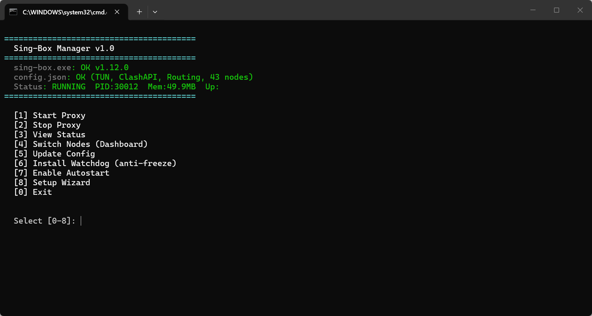

<p align="center">
  
</p>

<h1 align="center">Sing-Box Toolkit</h1>

<p align="center">
  <b>AI-Friendly · CLI-First · Zero-Dependency</b>
  <br>
  <sub>A lightweight launcher and health guardian for sing-box</sub>
</p>

<p align="center">
  
  
  
  
  
</p>

---

## Why This Exists

**sing-box is a powerful proxy core. But it's a CLI program — no GUI, no health monitoring, no autostart.**

Most users install bloated Electron apps (200MB+) to get a friendly interface.

This toolkit takes a different path: **a few KB of scripts that wrap sing-box with a clean terminal menu, automatic health monitoring, and a totally GUI-free experience.**

And because everything is file + command driven, **AI agents (Claude Code, Copilot, Cursor) can read logs, diagnose issues, and control the proxy programmatically.** No other proxy manager does this.

<p align="center">
  
</p>

---

## Architecture

```
                    ┌─────────────────────────┐
                    │      manage.bat          │  ← double-click to open
                    │   Interactive Menu       │
                    │                          │
   You / AI Agent → │  [1] Start  [2] Stop     │
                    │  [3] Status  [4] Nodes   │
                    │  [5] Update  [6] WDTask │
                    │  [7] AutoStart  [0] Exit │
                    │                          │
                    └────────┬────────────────┘
                             │ calls
                    ┌────────▼────────────────┐
                    │   scripts/*.ps1          │  ← all logic in scripts
                    │                          │
                    │  env.ps1    environment  │
                    │  menu.ps1   UI engine    │
                    │  start.ps1  launcher     │
                    │  status.ps1 diagnostics  │
                    │  update.ps1 subscription │
                    │  watchdog.ps1 guardian   │
                    │  setup.ps1   wizard      │
                    │                          │
                    └────────┬────────────────┘
                             │ manages
              ┌──────────────┴──────────────┐
              │                             │
     ┌────────▼───────┐          ┌──────────▼──────┐
     │  sing-box.exe   │          │  config.json     │
     │  (user drops)   │          │  (user drops)    │
     └────────────────┘          └─────────────────┘
```

---

## Features

### 🟢 Core

| Feature | Description |
|---|---|
| **One-Click Start/Stop** | Double-click `manage.bat`, choose [1] or [2] |
| **Status Dashboard** | PID, memory, uptime, TUN adapter, ports, connectivity — all in one view |
| **Node Switching** | Built-in YACD dashboard at `http://127.0.0.1:9090/ui` |
| **Config Update** | Pull latest config from your provider, auto-validate, auto-rollback on failure |
| **Auto-Start** | Windows Scheduled Task, SYSTEM privilege, crash retry ×3 |

### 🛡️ Watchdog (Health Guardian)

The standout feature — **automatic recovery from proxy freezes:**

| Task | Interval | What it does |
|---|---|---|
| Health Check | Every 5 min | Process alive? Port listening? Network reachable? → Auto-restart if not |
| Daily Restart | 4:00 AM daily | Proactive restart to prevent chronic memory leaks |
| Memory Guard | Every 10 min | Memory > 600MB? → Auto-restart |

All events logged to `logs\watchdog.log`. AI agents can read this file to diagnose issues.

### 🤖 AI-Native Design

```
# Any AI agent can do this:
cat logs\watchdog.log                     # read health history
powershell -File scripts\status.ps1       # check live status
Invoke-RestMethod :9090/proxies          # list all nodes
Invoke-RestMethod :9090/proxies/MAIN -Method PUT -Body '{"name":"JP-1"}'  # switch node
powershell -File scripts\start.ps1        # restart proxy
```

No GUI clicking. No OCR. No screenshot needed. **Every function is a command or file.**

---

## Quick Start

```
1. Download sing-box.exe
   → Place in this directory
   https://github.com/Sagernet/sing-box/releases

2. Get your config.json
   → Place in this directory
   (from your service provider)

3. Double-click manage.bat → [8] Setup Wizard
```

That's it. The wizard auto-detects everything and sets up autostart + watchdog.

---

## Directory

```
sing-box-toolkit/
├── manage.bat              ← 🔥 THE entry point
├── sing-box.exe            ← you drop this
├── config.json              ← you drop this
│
├── scripts/                 ← all logic
│   ├── env.ps1              ← environment detection
│   ├── menu.ps1             ← interactive menu engine
│   ├── setup.ps1            ← one-click setup wizard
│   ├── start.ps1 / stop.ps1
│   ├── status.ps1           ← full diagnostics
│   ├── update.ps1           ← config updater
│   └── watchdog.ps1         ← health guardian
│
├── ui/                      ← YACD dashboard
├── logs/                    ← watchdog.log
├── backup/                  ← config backups
└── README.md
```

---

## Requirements

- **Windows** (10/11)
- **PowerShell 5.1+** (built-in, no install needed)
- **sing-box.exe** (download from [official releases](https://github.com/Sagernet/sing-box/releases))
- **config.json** (from your service provider)
- **Admin rights** (required for TUN mode only — right-click `manage.bat` → Run as Administrator)

That's it. No Node.js. No Electron. No .NET runtime. No Docker.

---

## Comparison

| | Clash Verge | sing-box (raw) | **This Toolkit** |
|---|---|---|---|
| Interface | Electron GUI | CLI | Terminal Menu + Web Panel |
| Size | ~200 MB | ~35 MB | + ~20 KB |
| Dependencies | Node.js runtime | none | **none** |
| Auto-Start | ✅ | ❌ | ✅ |
| Health Monitor | ❌ | ❌ | ✅ Watchdog |
| Memory Guard | ❌ | ❌ | ✅ |
| AI-Agent Friendly | ❌ (GUI only) | ✅ | ✅ **native** |
| Zero-Config Setup | ❌ | ❌ | ✅ Wizard |
| Chinese UI | ✅ | ❌ | ✅ |

---

## FAQ

**Q: Can AI agents really control this?**
A: Yes. All functions are script files or REST API calls. An AI can `cat watchdog.log` to see if the proxy froze, `Invoke-RestMethod :9090/proxies` to switch nodes, or run `scripts/status.ps1` to get a structured status report — no GUI interaction needed.

**Q: Does this bundle sing-box or any proxy nodes?**
A: No. This is purely scripts. You download sing-box from its official source and obtain config.json from your own provider.

**Q: What if I already have sing-box running?**
A: The menu auto-detects running instances. You can use this toolkit as a management layer on top of any existing sing-box setup.

**Q: Can I use this on macOS / Linux?**
A: Currently Windows-only (uses Windows Scheduled Tasks and `Get-Process`). PRs welcome for cross-platform support.

---

## License

MIT — do whatever you want with the scripts.

sing-box itself is [GPLv3](https://github.com/Sagernet/sing-box/blob/main/LICENSE) and must be downloaded separately.

---

<p align="center">
  <sub>Built for humans. Designed for AI agents. No bloat.</sub>
</p>
